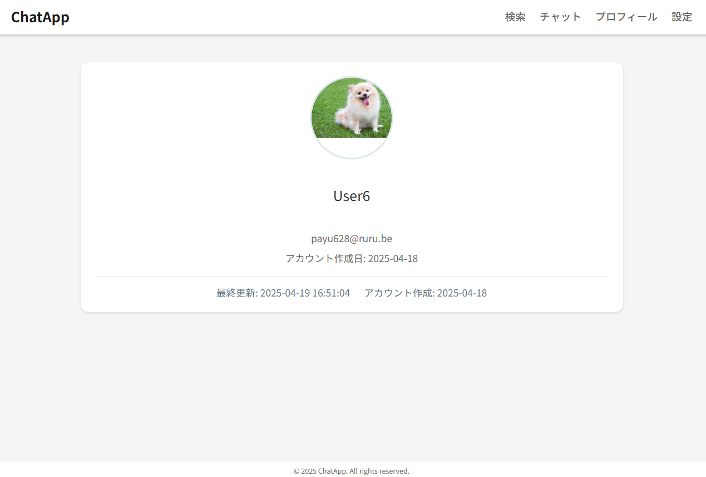
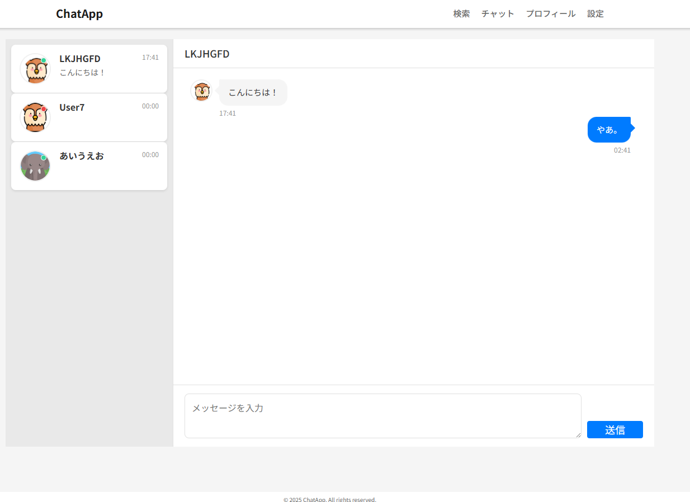
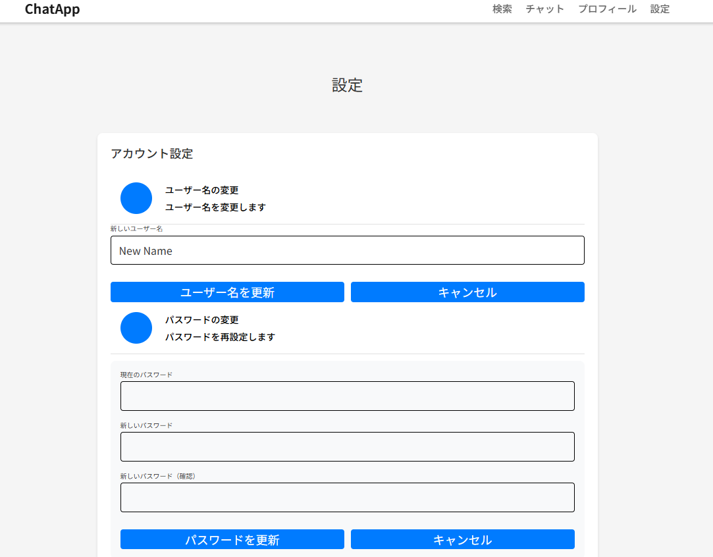
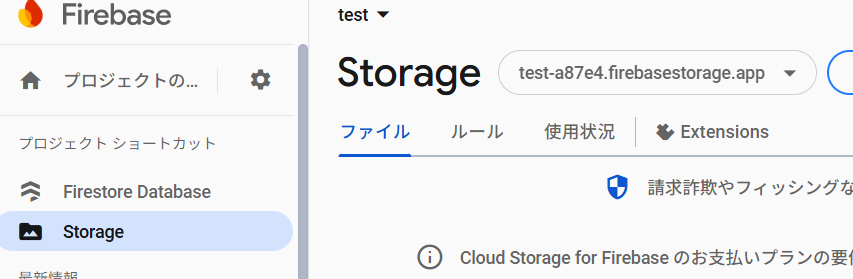
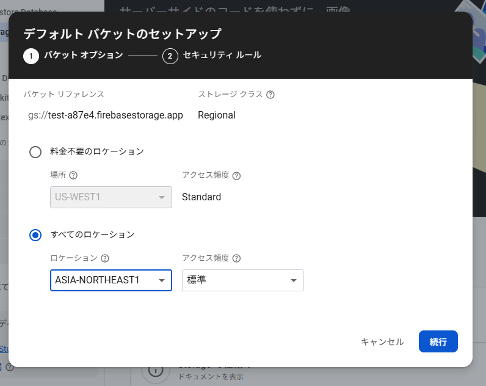
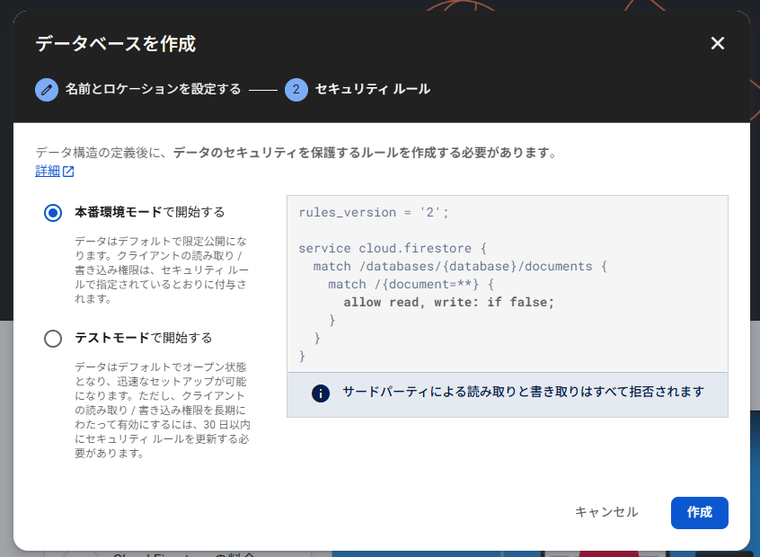
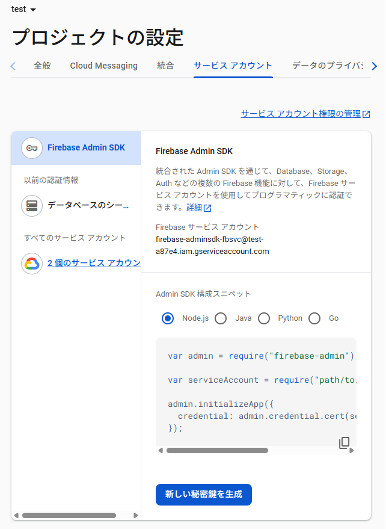

# Go-Chat-App

[English](./docs/lang/en.md) | 日本語

Go を使用した基本的なチャットアプリ

## スクリーンショット(2025.04.19 時点)






## 実装済み機能

- 認証機能（登録/ログイン/ログアウト）
- プロフィール（ユーザー名・画像・パスワードなどの変更）
- 検索機能（登録済みユーザーのフィルタリング）
- チャット機能（他ユーザーと連絡）

## 使用技術

- Go
- Firebase(firestore, storage)
- HTML/CSS(SCSS)/JavaScript
- stylelint, prettier, gulp

## ローカルへの導入手順

1. **プロジェクトの clone**

   ```bash
   git clone git@github.com:Kazu-K0032/go-chat-app.git
   ```

2. **Firebase から Firebase Admin SDK の認証ファイルを取り込む**

   - [Firebase](https://console.firebase.google.com/u/1/?hl=ja)からプロジェクトを作成
   - 作成したプロジェクトにアクセスし、「プロジェクトの設定」⇒「サービスアカウント」⇒「新しい鍵を生成」

     
     

   - ダウンロードしたファイル名を「serviceAccountKey.json」に変更し、クローンしたプロジェクトの`internal/config/`に配置してください

3. **Firestore の設定**

   - 左サイドバー「構築」⇒「Firestore Database」から、「データベースを作成」

     
     

   - 「Cloud Firestore」⇒「ルール」タブから、以下のルールであることを確認

     ```js
     rules_version = '2';

     service cloud.firestore {
       match /databases/{database}/documents {
         match /{document=**} {
           allow read, write: if false;
         }
       }
     }
     ```

4. **Storage の設定**

   - 左サイドバー「構築」⇒「Storage」を選択

     - Storage を始める場合、請求先設定が必要になります。

      
      

   - 「Storage」⇒「ルール」タブから、以下のルールに変更

     ```js
     rules_version = '2';
     service firebase.storage {
       match /b/{bucket}/o {
         match /icons/default/{fileName} {
           allow read: if true;
           allow write: if false;
         }
         match /icons/{userId}/{fileName} {
           allow read: if true;
           allow write: if request.auth != null && request.auth.uid == userId;
         }
         match /{allPaths=**} {
           allow read, write: if request.auth != null;
         }
       }
     }
     ```

5. **設定ファイルの修正（`config.ini`）**

   - または `config.ini` をコピーし `config.local.ini`に変更してください。

   - ポートの設定をしています。ご自身の環境に合わせて、随時修正してください。

   ```txt
   [web]
   port = 8050
   logfile = debug.log
   static = app/views

   [firebase]
   defaultIconDir = icons/default/
   serviceKeyPath = internal/config/serviceAccountKey.json // serviceAccountKey.jsonの相対パス
   projectId = // <プロジェクトの設定> -> <全般> -> <プロジェクトID> の値
   storageBucket = // <Storage> -> <バケット ex: testa87e4.firebasestorage.app>
   ```

   ### 参考(projectId)

   

   ### 参考(storageBucket)

   

6. **モジュール初期化および依存解決**

   - 事前に、Go 及び Node.js をダウンロードしてください。

     - バージョンは、Go は最低 1.21 以上, Node.js は v16.0.0 以上を目安に更新してください。

     ```bash
     go version
     node -v
     ```

   - 以下を実行してください。
     ```:bash
     cd go-chat-app/

     # Go モジュールの初期化
     go mod tidy

     # Node.jsの依存解決
     npm install
     ```

7. **サーバーの起動**

   ```bash
   go run cmd/app/main.go
   ```

   - 実行後、`debug.log`が生成されます。
   - デフォルトだと、`localhost:8050`にアクセスできるようになります。
