# Go-Chat-App

[日本語](../../README.md) | English

A basic chat application using Go

## Screenshots (as of 2025.04.19)

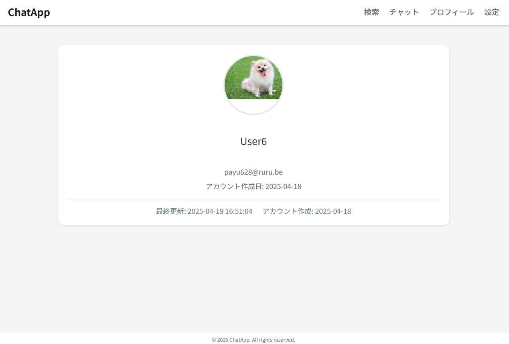
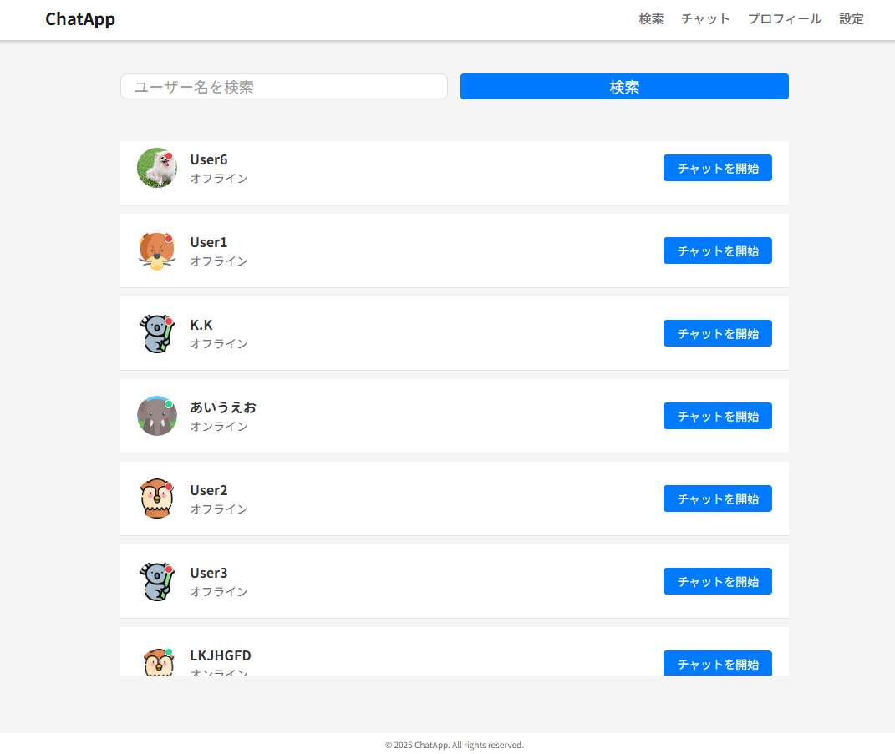
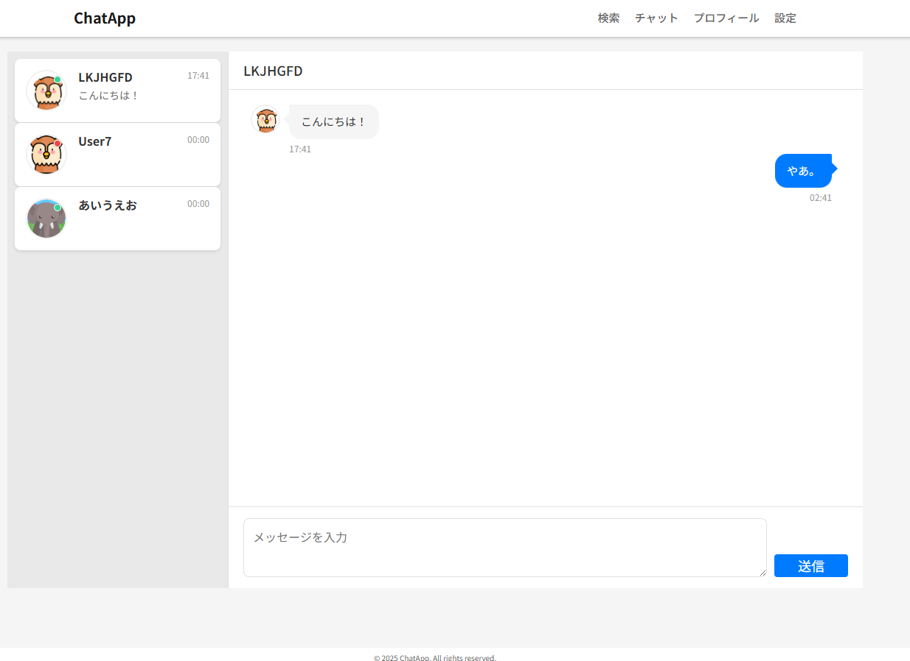
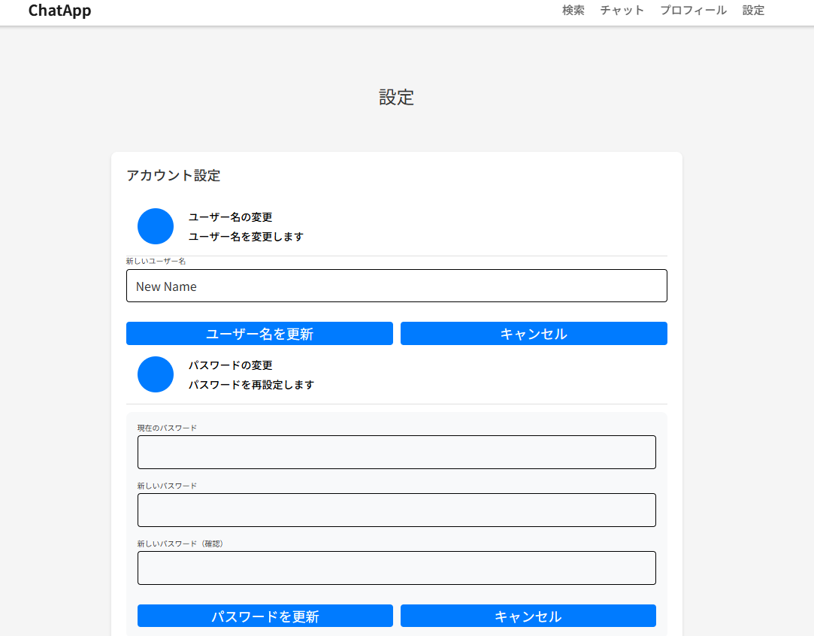

## Implemented Features

- Authentication (registration/login/logout)
- Profile (username, image, password changes, etc.)
- Search functionality (filtering registered users)
- Chat functionality (contact with other users)

## Technologies Used

- Go
- Firebase (firestore, storage)
- HTML/CSS(SCSS)/JavaScript
- stylelint, prettier, gulp

## Local Setup Instructions

1. **Clone the project**

   ```bash
   git clone git@github.com:Kazu-K0032/go-chat-app.git
   ```

2. **Import Firebase Admin SDK authentication file from Firebase**

   - Create a project from [Firebase](https://console.firebase.google.com/u/1/?hl=ja)
   - Access the created project, go to "Project Settings" ⇒ "Service Accounts" ⇒ "Generate New Key"

     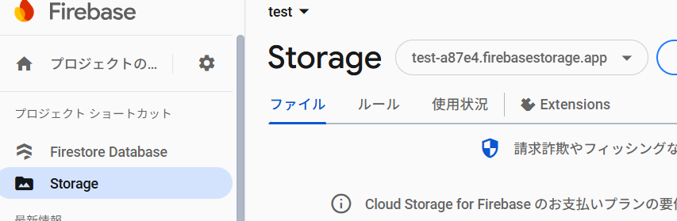
     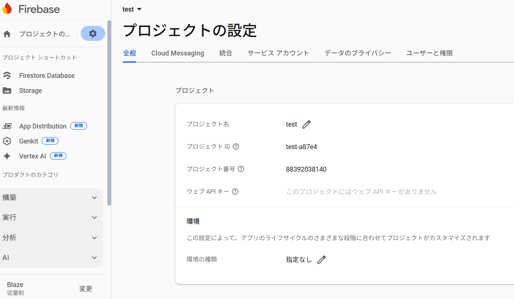

   - Rename the downloaded file to "serviceAccountKey.json" and place it in the `internal/config/` directory of the cloned project

3. **Firestore Configuration**

   - From the left sidebar "Build" ⇒ "Firestore Database", select "Create Database"

     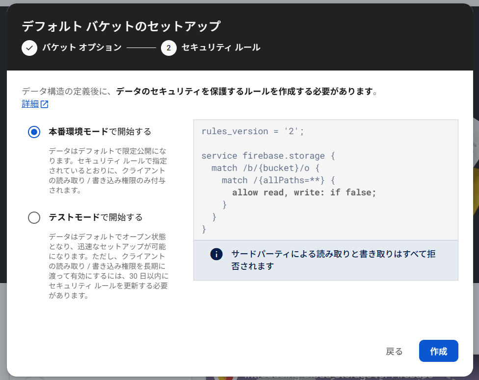
     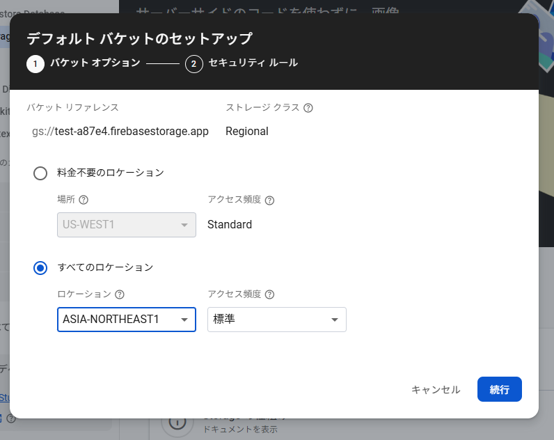

   - From "Cloud Firestore" ⇒ "Rules" tab, confirm the following rules:

     ```js
     rules_version = '2';

     service cloud.firestore {
       match /databases/{database}/documents {
         match /{document=**} {
           allow read, write: if false;
         }
       }
     }
     ```

4. **Storage Configuration**

   - Select "Build" ⇒ "Storage" from the left sidebar

     - When starting Storage, billing setup will be required.

      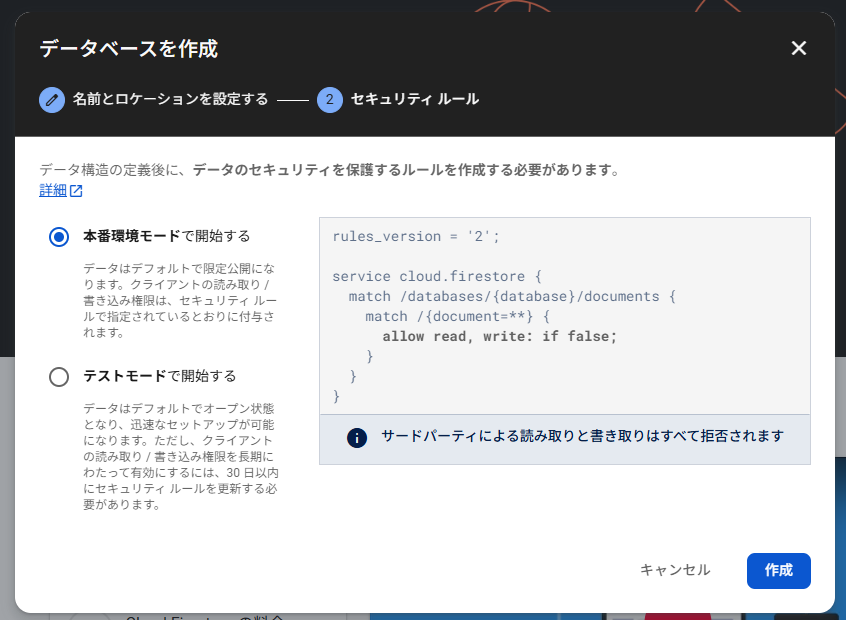
      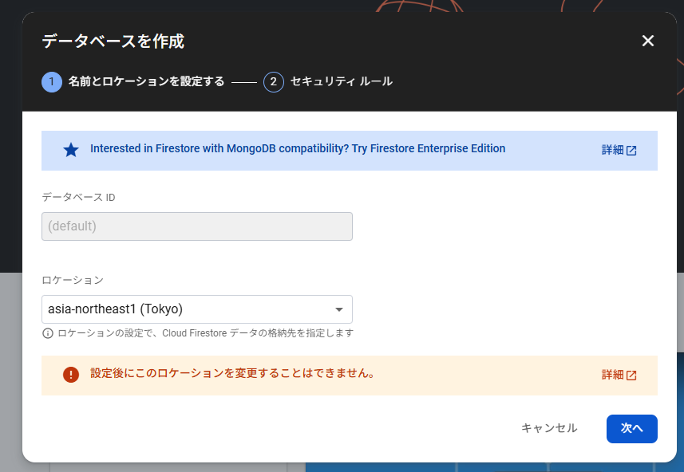

   - From "Storage" ⇒ "Rules" tab, change to the following rules:

     ```js
     rules_version = '2';
     service firebase.storage {
       match /b/{bucket}/o {
         match /icons/default/{fileName} {
           allow read: if true;
           allow write: if false;
         }
         match /icons/{userId}/{fileName} {
           allow read: if true;
           allow write: if request.auth != null && request.auth.uid == userId;
         }
         match /{allPaths=**} {
           allow read, write: if request.auth != null;
         }
       }
     }
     ```

5. **Configuration file modification (`config.ini`)**

   - Or copy `config.ini` and rename it to `config.local.ini`.

   - Port settings are configured. Please modify as needed according to your environment.

   ```txt
   [web]
   port = 8050
   logfile = debug.log
   static = app/views

   [firebase]
   defaultIconDir = icons/default/
   serviceKeyPath = internal/config/serviceAccountKey.json // Relative path to serviceAccountKey.json
   projectId = // Value from <Project Settings> -> <General> -> <Project ID>
   storageBucket = // <Storage> -> <Bucket ex: testa87e4.firebasestorage.app>
   ```

   ### Reference (projectId)

   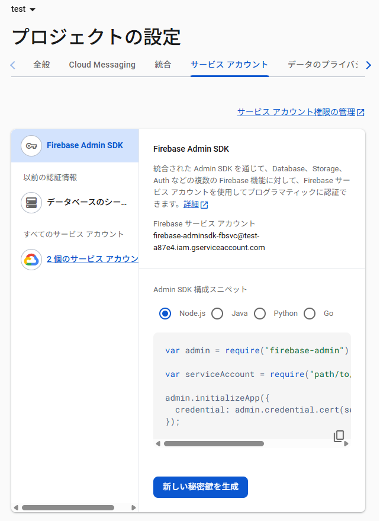

   ### Reference (storageBucket)

   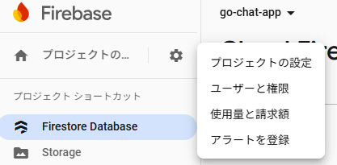

6. **Module initialization and dependency resolution**

   - Please download Go and Node.js in advance.

     - For versions, please update to Go 1.21 or higher and Node.js v16.0.0 or higher as a guideline.

     ```bash
     go version
     node -v
     ```

   - Please execute the following:

     ```:bash
     cd go-chat-app/

     # Go module initialization
     go mod tidy

     # Node.js dependency resolution
     npm install
     ```

7. **Server startup**

   ```bash
   go run cmd/app/main.go
   ```

   - After execution, `debug.log` will be generated.
   - By default, you can access `localhost:8050`.
